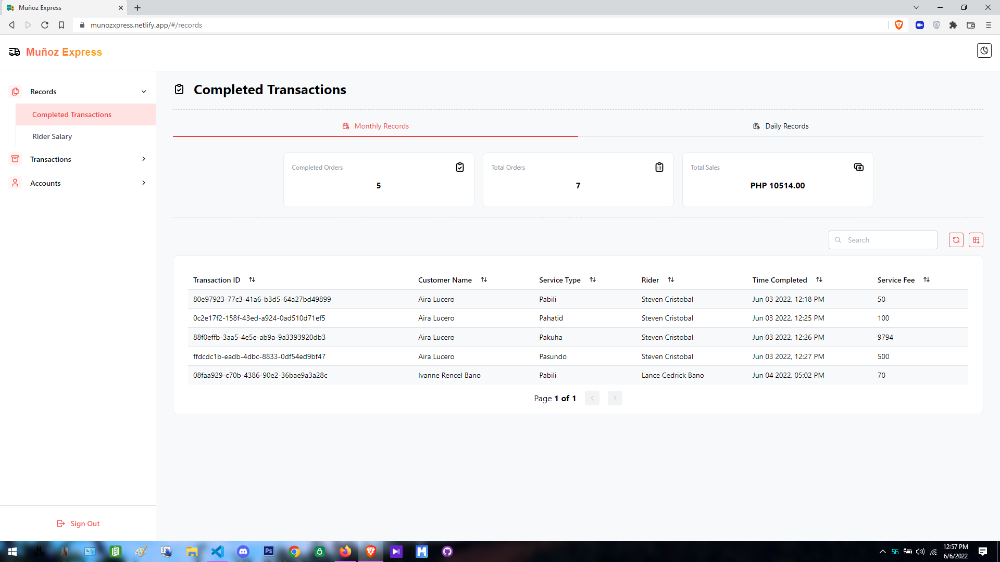
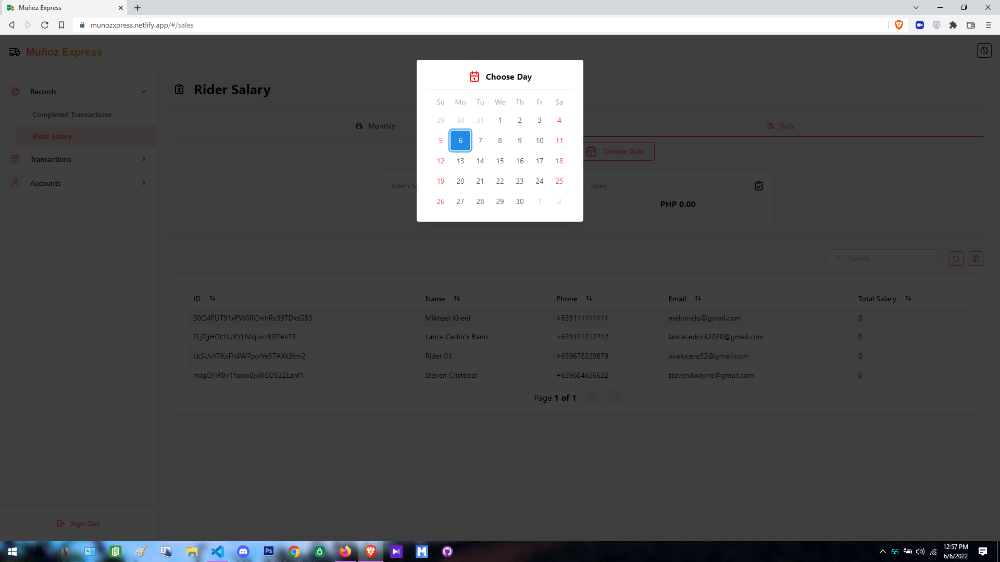
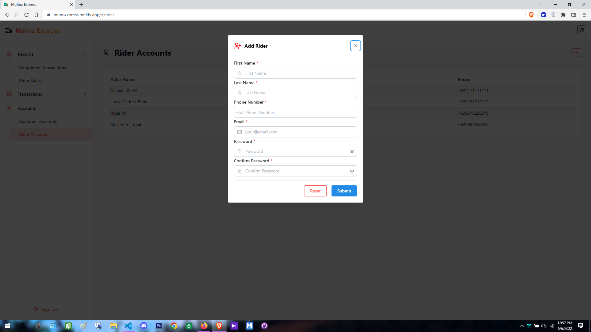
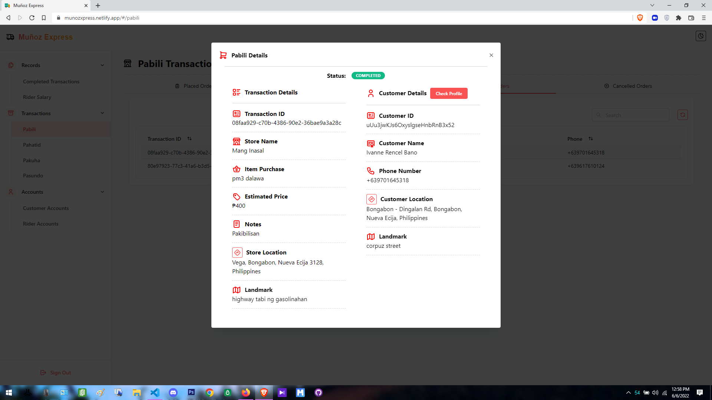

# Muñoz Express Web

Muñoz Express Web is the admin side of our thesis project.
It manage the transactions that is happenning our android app.

## Screenshots

   
    

## Features

- Create Rider Account
- Manage transactions
- Summary Of Monthly / Daily Sales
- Rider Earnings Monthly / Daily
- Export Completed transactions to Excel

## Built with

- ReactJS
- Typescript
- Mantine Ui
- Firebase

## License

This project is licensed under the GPL-3.0 - see the license file for more details
